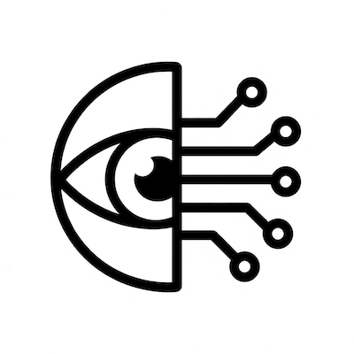
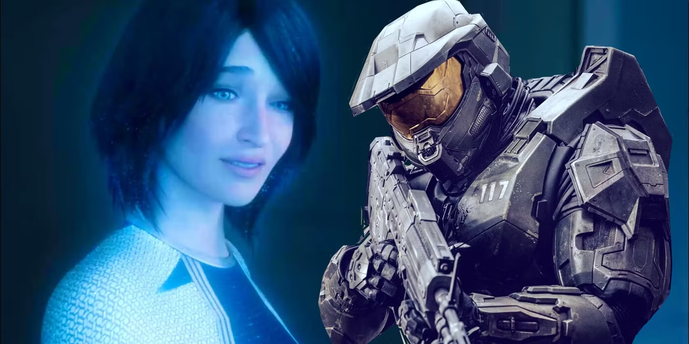
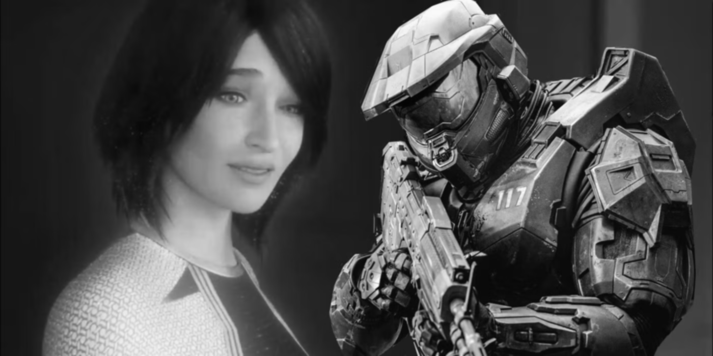
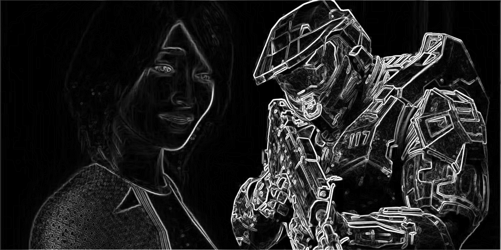

#  CVL

_Computer Vision Library in C._

[docs](https://owenmastropietro.github.io/projects/cvl/)

---

**CVL** implements a small computer vision library for raster images with support for reading and writing [Netpbm](https://netpbm.sourceforge.net/doc/ppm.html) image formats (PGM, PGM, PPM), along with thresholding, filtering, connected component labeling, and edge detection.

---

## Usage

> Build and run example programs.

```sh
# Manual Compile & Execute.
gcc examples/<example>.c src/* -Iinclude -o <example>
./<example>

# With CMake.
cmake -B build -S .
cmake --build build

./build/<example>
```

> Build and run tests.

```sh
cmake -B build -S . -DBUILD_TESTS=ON
cmake --build build

ctest --test-dir build
```

## Example Programs

> See the [docs](https://owenmastropietro.github.io/projects/cvl/) for more examples and documentation.

| Executable      | Source File                                      | Description                  |
| --------------- | ------------------------------------------------ | ---------------------------- |
| `cvl_color`     | [`examples/color.c`](./examples/color.c)         | Color Conversion             |
| `cvl_threshold` | [`examples/threshold.c`](./examples/threshold.c) | Thresholding                 |
| `cvl_blur`      | [`examples/blur.c`](./examples/blur.c)           | Blurring / Smoothing         |
| `cvl_ccl`       | [`examples/ccl.c`](./examples/ccl.c)             | Connected Component Labeling |
| `cvl_sobel`     | [`examples/sobel.c`](./examples/sobel.c)         | Sobel Filtering              |
| `cvl_cs136`     | [`examples/cs136.c`](./examples/cs136.c)         | Assignments from CS136       |

## Example Results

> See the [docs](https://owenmastropietro.github.io/projects/cvl/) for more examples and documentation.

### Sobel Filtering.

```c
#include <cvl/cvl.h>

int main(void) {
    // Load Input Image.
    cvl_Mat img = cvl_imread("./data/original/halo.ppm");

    // Convert to Grayscale and Smooth.
    cvl_Mat gray = cvl_cvt_color_new(&img, CVL_COLOR_RGB2GRAY);
    cvl_Mat blur = cvl_blur_gauss_new(&gray, 0.0, 1.0);

    // Apply Sobel Filter (for gradient magnitudes).
    cvl_Mat sobel = cvl_sobel_mag_new(&blur);

    // Save Results.
    cvl_imwrite("./data/modified/1-original.ppm", &img);
    cvl_imwrite("./data/modified/2-blur.pgm", &blur);
    cvl_imwrite("./data/modified/5-mags.pgm", &sobel);

    // Cleanup.
    cvl_mat_free(&sobel);
    cvl_mat_free(&blur);
    cvl_mat_free(&gray);
    cvl_mat_free(&img);

    return 0;
}
```

|          Original          |                Smoothed Grayscale                 |              Sobel Magnitudes               |
| :------------------------: | :-----------------------------------------------: | :-----------------------------------------: |
|  |  |  |

---
