#  CVL

_Computer Vision Library in C._

[docs](https://owenmastropietro.github.io/projects/cvl/)

---

**CVL** implements a small computer vision library for raster images with support for reading and writing [Netpbm](https://netpbm.sourceforge.net/doc/ppm.html) image formats (PGM, PGM, PPM), along with thresholding, filtering, connected component labeling, edge detection, and more.

---

## Usage

> Build and run example programs.

```sh
# Manual Compile & Execute.
gcc examples/<example>.c src/* -Iinclude -o <example>
./<example>

# With CMake.
cmake -B build -S .
cmake --build build

./build/examples/<example>
```

> Build and run tests.

```sh
cmake -B build -S . -DBUILD_TESTS=ON
cmake --build build

ctest --test-dir build
```

## Example Programs

> See the [docs](https://owenmastropietro.github.io/projects/cvl/) for more examples and documentation.

| Executable | Source File | Description |
| ---------- | ----------- | ----------- |
| `hough_lines` | [`examples/hough_lines.c`](./examples/hough_lines.c) | Hough Line Detection |
| `hough_circles` | [`examples/hough_circles.c`](./examples/hough_circles.c) | Hough Circle Detection |
| `sobel` | [`examples/sobel.c`](./examples/sobel.c) | Sobel Filtering |
| `canny` | [`examples/canny.c`](./examples/canny.c) | Canny Edge Detection |
| `laplacian` | [`examples/laplacian.c`](./examples/laplacian.c) | laplacian Edge Detection |
| `ccl` | [`examples/ccl.c`](./examples/ccl.c) | Connected Component Labeling |
| `cs136` | [`examples/cs136.c`](./examples/cs136.c) | Assignments from CS136 |

## Demonstrations

> See the [docs](https://owenmastropietro.github.io/projects/cvl/) for more demonstrations.

### Sobel Filtering.

```c
// Example: Applying a Sobel Filter.

#include <cvl/cvl.h>

#include <math.h>

int main(void) {
    // Load Input Image.
    Image img = cvl_imread("./data/original/halo.ppm");
    Matrix mat = cvl_img2mat(img);
    Matrix blur = cvl_blur_gauss_new(&mat, 1);

    // Apply Sobel Filter (for directional gradients).
    Matrix gx = cvl_mat_create(mat.height, mat.width);
    Matrix gy = cvl_mat_create(mat.height, mat.width);
    cvl_sobel(&blur, &gx, &gy);

    // Apply Sobel Filter (for gradient magnitudes and angles).
    Matrix mags = cvl_sobel_mag(&blur);

    // Save Results.
    Image gx_img = cvl_mat2img(gx, 0, 1);
    Image gy_img = cvl_mat2img(gy, 0, 1);
    Image mags_img = cvl_mat2img(mags, 0, 1);
    // cvl_binarize(&mags_img, 128);

    cvl_imwrite("./data/modified/1-original.ppm", &img);
    cvl_imwrite("./data/modified/2-mags.pgm", &mags_img);
    cvl_imwrite("./data/modified/3-grads-horizontal.pgm", &gx_img);
    cvl_imwrite("./data/modified/4-grads-vertical.pgm", &gy_img);

    // free memory...

    return 0;
}
```

|          Original          |           Sobel Magnitudes           |
| :------------------------: | :----------------------------------: |
|  | 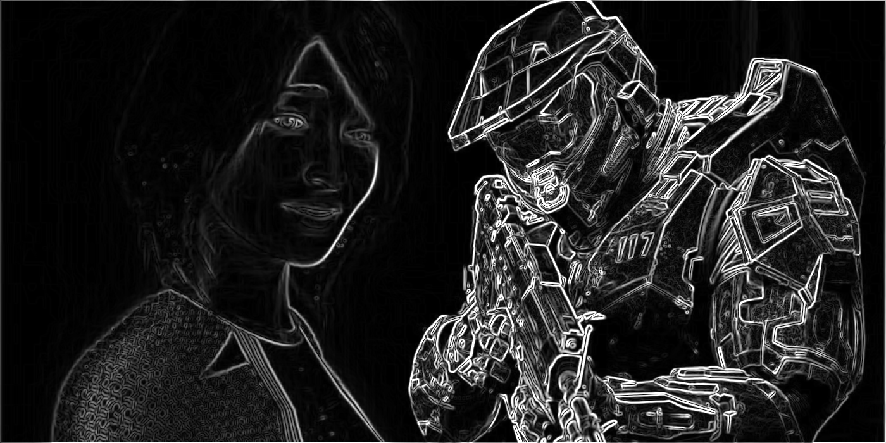 |

|             Sobel Gx             |             Sobel Gy             |
| :------------------------------: | :------------------------------: |
| 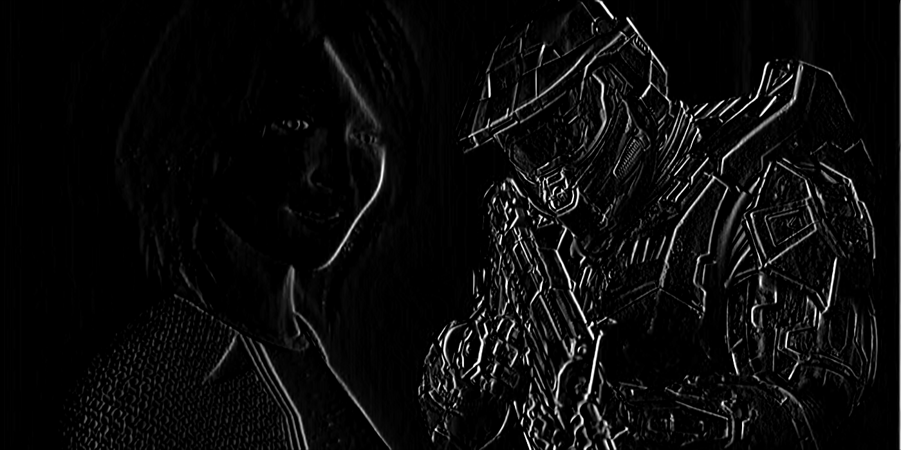 | 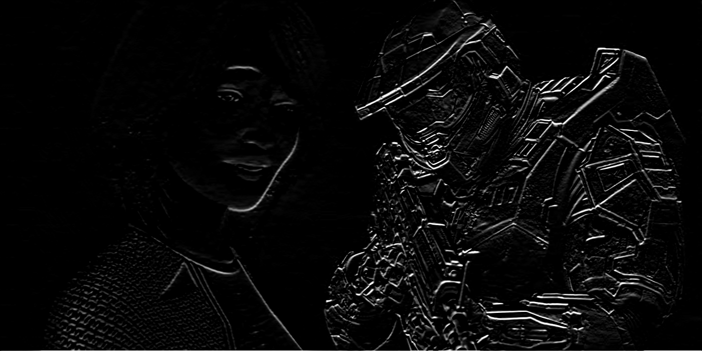 |

### Canny Edge Detection.

```c
#include <cvl/cvl.h>

int main(void) {
    Image img = cvl_imread("lena.ppm");
    Image binary = cvl_binarize_new(&img, 128);

    Matrix lena = cvl_img2mat(binary);

    const int sigma = 1;
    const int lo    = 50;
    const int hi    = 120;
    Matrix edges = cvl_canny_new(&lena, sigma, lo, hi);

    Image edges_img = cvl_mat2img(edges, 0, 1);

    cvl_imwrite("original.ppm", &img);
    cvl_imwrite("binary.pbm", &binary);
    cvl_imwrite("canny.pgm", &edges_img);

    // free memory...

    return 0;
}
```

|          Original          |             Binary Threshold             |              Canny Edges               |
| :------------------------: | :--------------------------------------: | :------------------------------------: |
| 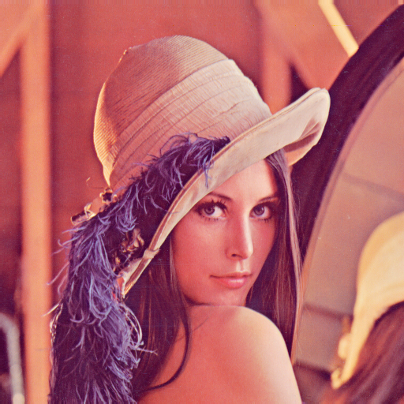 | 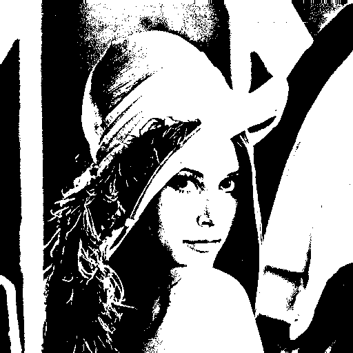 | 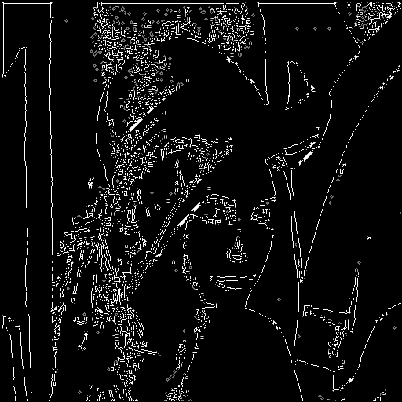 |

### Hough Circle Detection.

```c
#include <cvl/cvl.h>

int main(void) {
    // Load Input Image.
    Image img = cvl_imread("./data/original/circles.pgm");
    if (!img.map) fprintf(stderr, "bad read\n");

    Matrix input = cvl_img2mat(img); // convert depth (u8 to f64)

    // Hough Circle Detection.
    const double dp       = 1.0;
    const double min_dist = 40;
    const double thresh   = 15;
    const double canny_hi = 100;
    const int min_radius  = 15;
    const int max_radius  = 40;
    cvl_hough_circles_t circles = cvl_hough_circles_new(&input, dp, min_dist, canny_hi, thresh, min_radius, max_radius);

    // Save Results.
    printf("Found %zu circles.\n", circles.size);

    Image circles_img = cvl_img_create_fill(img.height, img.width, BLACK);
    // Image circles_img = cvl_img_copy(&img); // to overlay
    cvl_draw_hough_circles(&circles_img, &circles);

    cvl_imwrite("./data/modified/1-original.ppm", &img);
    cvl_imwrite("./data/modified/2-hough-circles.ppm", &circles_img);

    // free memory...

    return 0;
}

```

| Original | Canny Edges | Accumulator | Hough Circles |
| :------: | :---------: | :---------: | :-----------: |
| 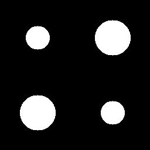 | 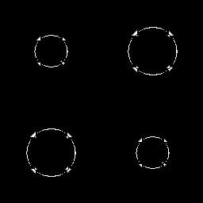 | 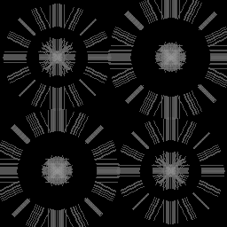 | 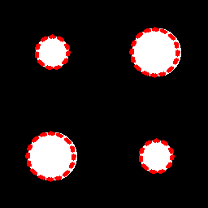
| 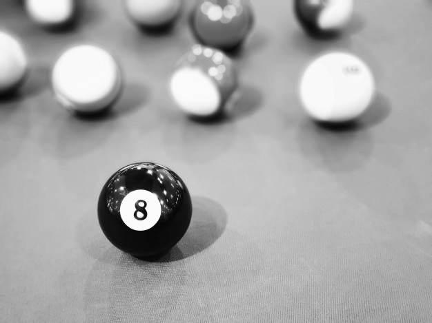 | 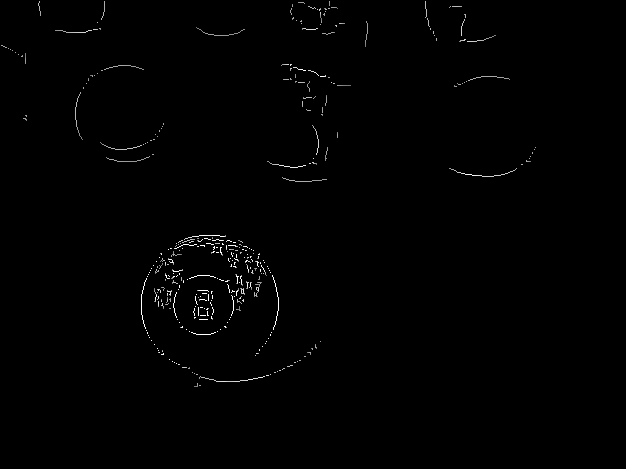 | 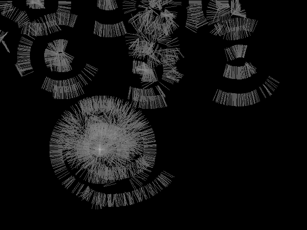 | 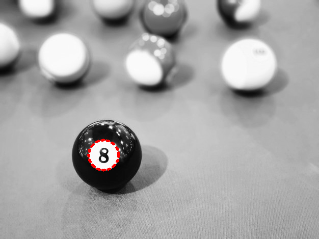 |

---
