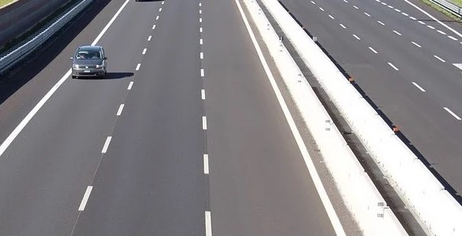
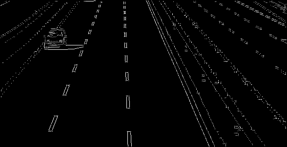
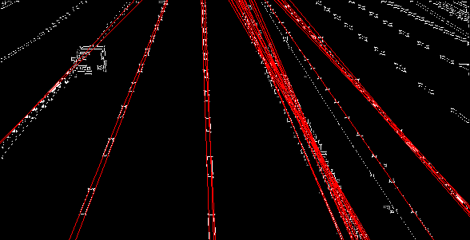
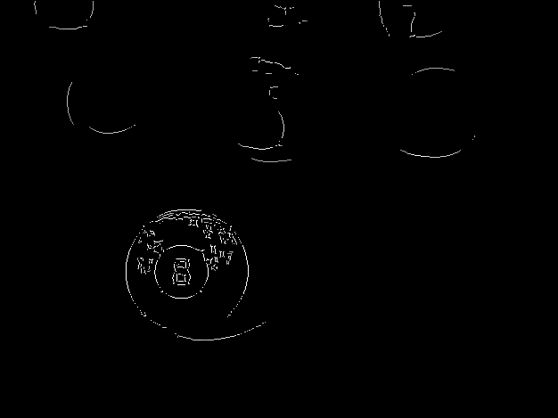
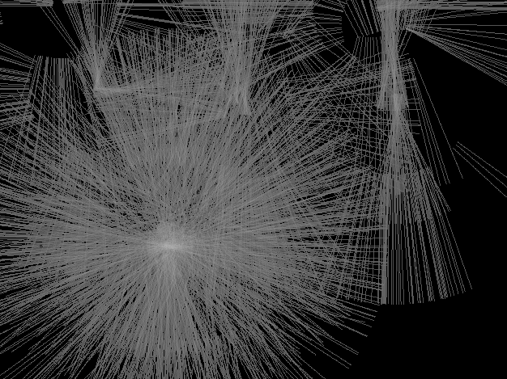
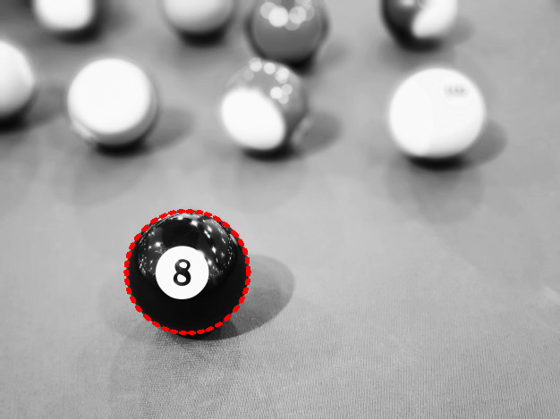

#  CVL

_Computer Vision Library in C._

[docs](https://owenmastropietro.github.io/projects/cvl/)

---

## Hough Transform

### API

| Feature | Function |
| ------- | -------- |
| Hough Line Detection   | [`cvl_hough_lines()`](https://github.com/OwenMastropietro/cvl/blob/c4df47648a63a6f0b0c22af58af1fa9521340dce/src/cvl_hough.c#L34)<br>[`cvl_hough_lines_new()`](https://github.com/OwenMastropietro/cvl/blob/c4df47648a63a6f0b0c22af58af1fa9521340dce/src/cvl_hough.c#L139)     |
| Hough Circle Detection | [`cvl_hough_circles()`](https://github.com/OwenMastropietro/cvl/blob/c4df47648a63a6f0b0c22af58af1fa9521340dce/src/cvl_hough.c#L204)<br>[`cvl_hough_circles_new()`](https://github.com/OwenMastropietro/cvl/blob/c4df47648a63a6f0b0c22af58af1fa9521340dce/src/cvl_hough.c#L423) |

### Hough Line Detection.

<!-- #### TODO: Desc

yes -->

#### Example Program

```c
#include <cvl/cvl.h>
#include <math.h>

int main(void) {
    // Load Input Image.
    Image img = cvl_imread("./data/original/lanes.ppm");
    if (!img.map) fprintf(stderr, "bad read\n");

    Matrix mat = cvl_img2mat(img); // convert depth (u8 to f64)

    // Canny Edge Detection.
    const int sigma = 1;
    const int lo    = 50;
    const int hi    = 120;
    Matrix edges = cvl_canny_new(&mat, sigma, lo, hi);
    Image edges_img = cvl_mat2img(edges, 0, 1);

    // Hough Line Detection.
    double drho   = 1.0;
    double dtheta = M_PI / 180.0;
    int    thresh = 70;
    cvl_hough_lines_t lines = cvl_hough_lines_new(&edges, drho, dtheta, thresh);

    // Save Results.
    printf("Found %zu lines.\n", lines.size);

    Image lines_img = cvl_img_copy(&edges_img);
    cvl_draw_hough_lines(&lines_img, &lines);

    cvl_imwrite("./data/modified/1-original.ppm", &img);
    cvl_imwrite("./data/modified/2-canny-edges.pgm", &edges_img);
    cvl_imwrite("./data/modified/3-hough-lines.ppm", &lines_img);

    // free memory...

    return 0;
}
```

#### Results

| Original | Canny Edges | Hough Lines |
| :------: | :---------: | :---------: |
|  |  |  |

### Hough Circle Detection.

<!-- #### TODO: Desc

yes -->

#### Example Program

> Note: there are two parameter configurations designed for the 8-ball image
> to demonstrate detecting different circles by modulating the hough circle parameters.
> They are referenced as `inner` to detect the smaller white circle on (in) the 8-ball and
> `outer` to detect the 8-ball itself.

```c
#include <cvl/cvl.h>

int main(void) {
    // Load Input Image.
    // Image img = cvl_imread("./data/original/four-circles-filled.pgm");
    Image img = cvl_imread("./data/original/8ball.pgm");
    if (!img.map) fprintf(stderr, "bad read\n");

    Matrix input = cvl_img2mat(img); // convert depth (u8 to f64)

    // Hough Circle Detection.
    bool inner = true; // detect inner vs. outer circle on 8-ball
    const double dp       = inner ?  1.0 : 1.0;
    const double min_dist = inner ?  40  : 20;
    const double thresh   = inner ?  15  : 10;
    const double canny_hi = inner ?  100 : 120;
    const int min_radius  = inner ?  15  : 40;
    const int max_radius  = inner ?  40  : 200;
    cvl_hough_circles_t circles = cvl_hough_circles_new(
        &input,
        dp,
        min_dist,
        canny_hi,
        thresh,
        min_radius,
        max_radius
    );

    // Save Results.
    printf("Found %zu circles.\n", circles.size);

    Image circles_img = cvl_img_copy(&img);
    cvl_draw_hough_circles(&circles_img, &circles);

    cvl_imwrite("./data/modified/1-original.ppm", &img);
    // todo: I think I'd rather pass in canny edges...
    cvl_imwrite("./data/modified/2-hough-circles.ppm", &circles_img);

    // Cleanup.
    cvl_hough_circles_free(&circles);
    cvl_img_free(circles_img);
    cvl_mat_free(input);
    cvl_img_free(img);
}

```

#### Results

| Original | Canny Edges | Accumulator | Hough Circles |
| :------: | :---------: | :---------: | :-----------: |
|  |           |        |      |
|                |  |  |  |
|                |        |        |  |

---
